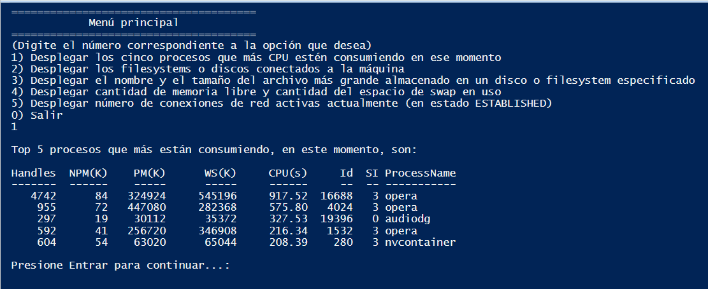
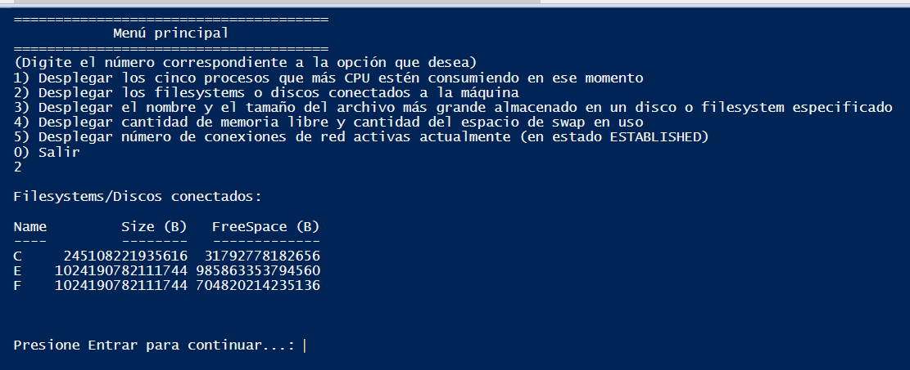
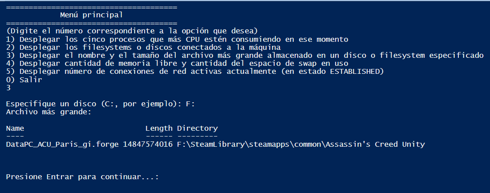
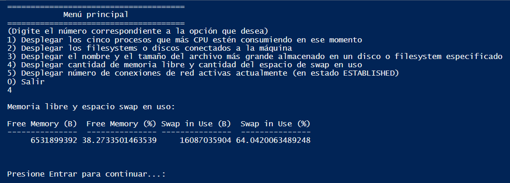
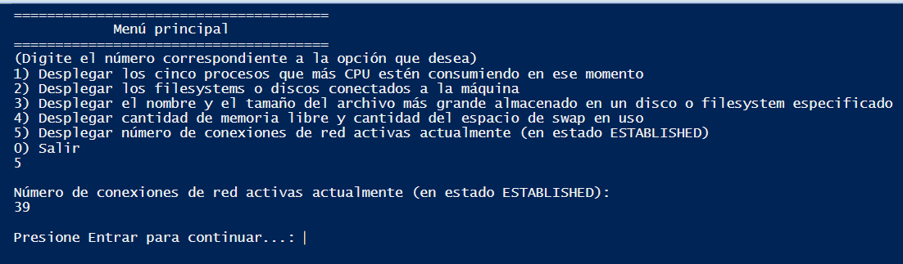

# Operative Systems Final Project

##### By

- Juan Diego Lora Lara
- Carlos Javier Bolaños Riascos
- Yuluka Gigante Muriel

---

## Table of contents

1. [PowerShell](#powershell)
   - [Point 1](#point-1)
   - [Point 2](#point-2)
   - [Point 3](#point-3)
   - [Point 4](#point-4)
   - [Point 5](#point-5)

---

## PowerShell

A PowerShell script has been developed that displays a menu that allows the user to select the desired option by typing the corresponding number. When the user types a number, the script executes the appropriate cmdlet, or displays a message telling the user that the typed number is not a valid option.

### Point 1

The problem posed was: "Desplegar los cinco procesos que más CPU estén consumiendo en ese momento".

To solve this problem, the cmdlet we used was:

```powershell
Get-Process | sort cpu -Descending | select -First 5
```

When the script is executed on our PC, the response we get is:



### Point 2

The problem posed was: "Desplegar los filesystems o discos conectados a la máquina. Incluir para cada disco su tamaño y la cantidad de espacio libre (en bytes)".

To solve this problem, the cmdlet we used was:

```powershell
Get-PSDrive -PSProvider FileSystem | select Name, @{Name="Size (B)"; Expression={($_.Used + $_.Free)*1KB}}, @{Name="FreeSpace (B)"; Expression={($_.Free)*1KB}} | ft
```

When the script is executed on our PC, the response we get is:



### Point 3

The problem posed was: "Desplegar el nombre y el tamaño del archivo más grande almacenado en un disco o filesystem que el usuario deberá especificar. El archivo debe aparecer con su trayectoria completa".

To solve this problem, the cmdlet we used was:

```powershell
$drive = Read-Host "Especifique un disco (C:, por ejemplo)"

dir -Path $drive -Recurse | sort Length -Descending | select Name, Length, Directory -First 1 | ft
```

When the script is executed on our PC, the response we get is:



### Point 4

The problem posed was: "Cantidad de memoria libre y cantidad del espacio de swap en uso (en bytes y porcentaje)".

To solve this problem, the cmdlet we used was:

```powershell
Get-WmiObject -Class Win32_OperatingSystem | select @{Name="Free Memory (B)"; Expression={$_.FreePhysicalMemory * 1KB}}, @{Name="Free Memory (%)"; Expression={(($_.FreePhysicalMemory * 1KB) / ($_.TotalVisibleMemorySize * 1KB)) * 100}}, @{Name="Swap in Use (B)"; Expression={($_.TotalVirtualMemorySize - $_.FreeVirtualMemory) * 1KB}}, @{Name="Swap in Use (%)"; Expression={(($_.TotalVirtualMemorySize - $_.FreeVirtualMemory) * 1KB) / ($_.TotalVirtualMemorySize * 1KB) * 100}} | ft
```

When the script is executed on our PC, the response we get is:



### Point 5

The problem posed was: "Número de conexiones de red activas actualmente (en estado ESTABLISHED)".

To solve this problem, the cmdlet we used was:

```powershell
(Get-NetTCPConnection -State Established).Count
```

When the script is executed on our PC, the response we get is:


